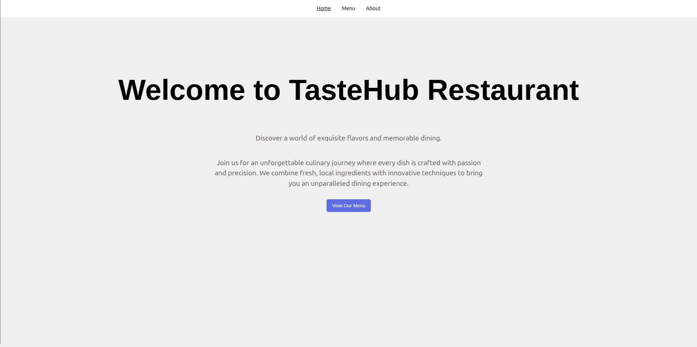
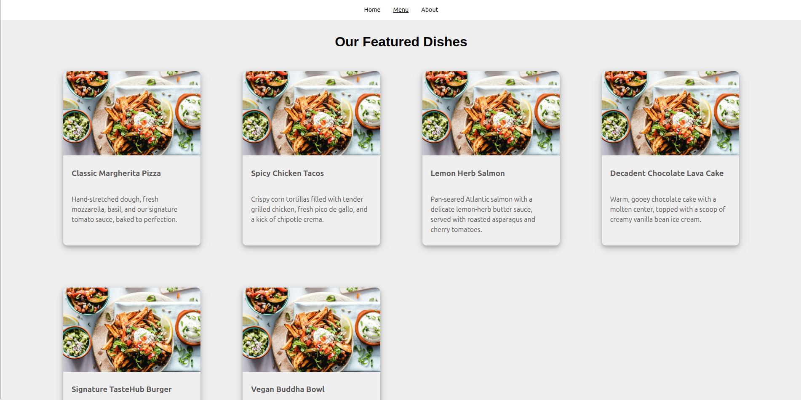
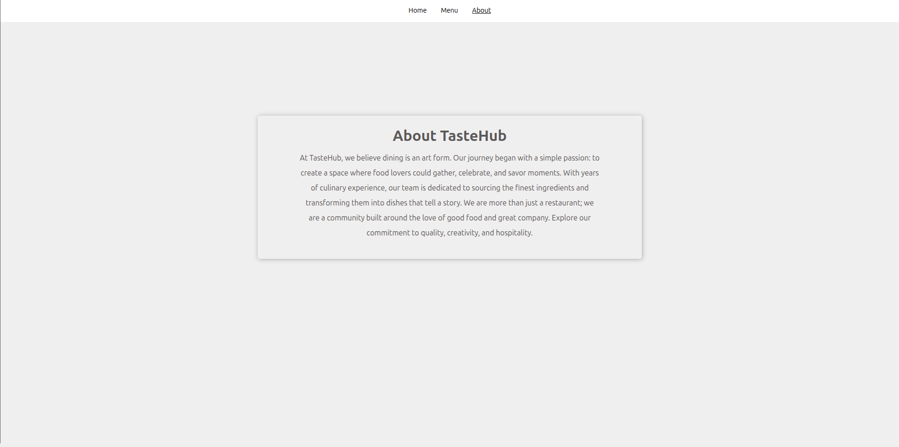

# 🍽️ TasteHub Restaurant Page

Welcome to **TasteHub**, a visually appealing and responsive restaurant landing page created as part of a web development learning journey. This project showcases modern HTML, CSS, and responsive layout techniques.

## 🔗 Live Demo

[Click here to view the live site](https://thejas2246.github.io/restaurant-page/)

---

## 📸 Screenshots

### 🏠 Home Page

### 🍴 Featured Dishes

### 📖 About Us

---

## 🧰 Tech Stack

- **HTML5**
- **CSS3** (Flexbox & Grid)
- **Responsive Design**
- **GitHub Pages** for deployment

---

## 🧾 Features

- ✅ Clean and modern layout
- ✅ Responsive design across all devices
- ✅ Structured sections: Home, Menu, About
- ✅ Flexbox/Grid for dynamic alignment
- ✅ Card-based menu with image, title, and description
